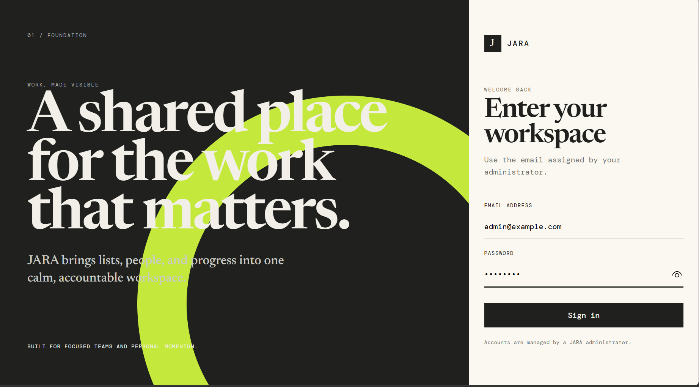
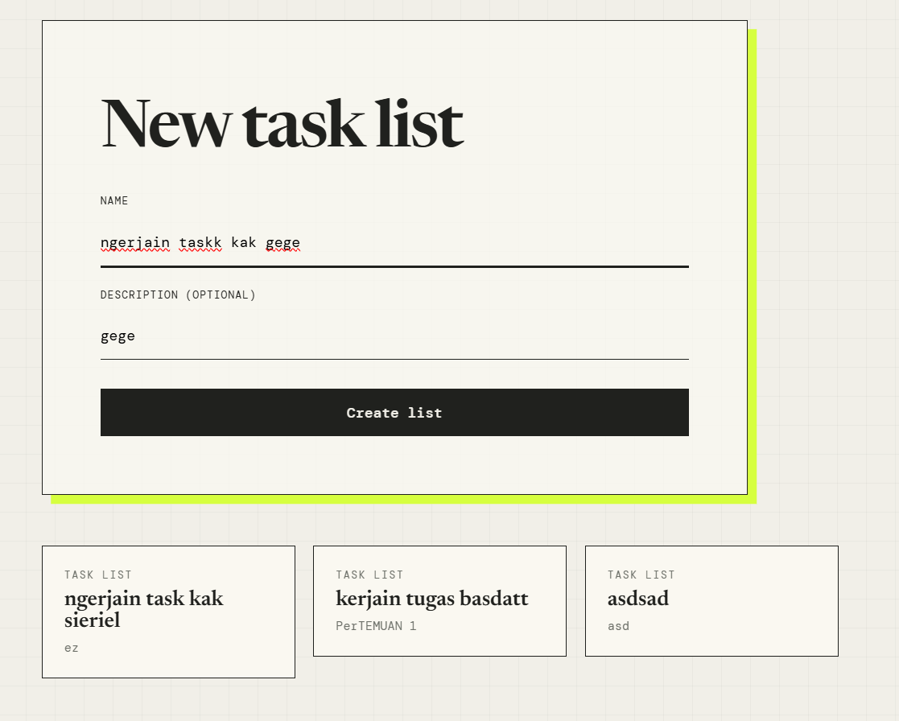
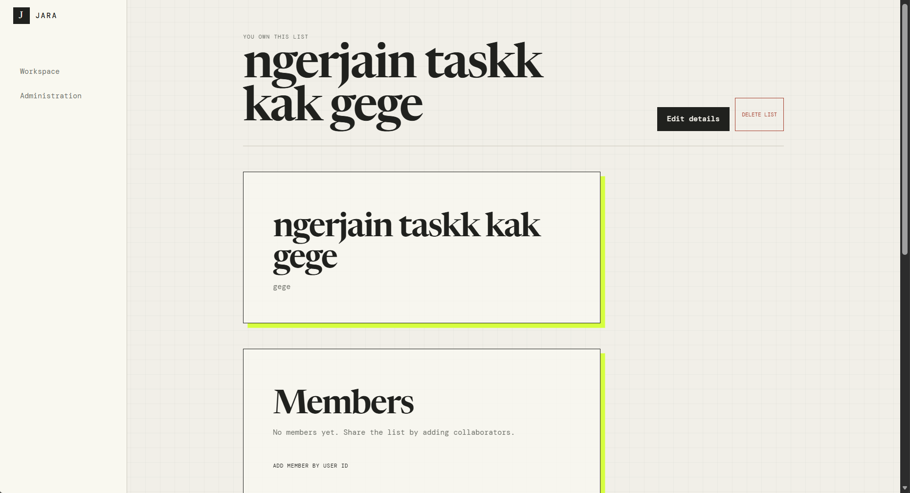

# JARA




JARA is a Laravel and React web application for managing personal and collaborative task lists. This repository provides the production-oriented engineering foundation for a four-person team and implements most of the product; remaining scope is tracked in the SRS.

## What JARA will support

- Account login and administrator-managed users, including administrator account deletion (SRS-028, deletion strategy open in ADR-011)
- A public landing page at `/` with a CTA to `/login` (SRS-032)
- Personal and shared task lists
- List membership and collaboration
- Tasks with multiple assignees (`assignee_ids` / `task_assignees` pivot, SRS-027), dates, deadlines, and status tracking
- List-level progress monitoring
- Ownership, membership, and administrator authorization
- Atomic multi-record operations with full rollback (SRS-029)
- Validated inputs and parameterized queries (SRS-030)
- A React UI built on the shadcn design system, preset `bhOibP160` (SRS-031)

## Technology

- Laravel 13, PHP 8.3+, Eloquent, migrations, validation, and Policies
- Laravel Sanctum cookie-based SPA authentication
- React 19, TypeScript, React Router, Axios, and Vite
- shadcn design system configured with preset `bhOibP160` (SRS-031)
- MySQL 8 for application data
- PHPUnit, Vitest, Testing Library, ESLint, Prettier, and Laravel Pint

## Requirements

- PHP 8.3 or later with `pdo_mysql`, `mbstring`, `openssl`, `tokenizer`, `xml`, and `ctype`
- Composer 2.8+
- Node.js 22.12+ and npm 10+
- MySQL 8+
- Git

## Installation

```bash
git clone <repository-url> jara
cd jara

composer install
npm ci

cp .env.example .env
php artisan key:generate
```

On Windows PowerShell, use `Copy-Item .env.example .env` instead of `cp` if needed.

Create an empty MySQL database and a least-privileged local user, then update the `DB_*` values in `.env`:

```dotenv
DB_CONNECTION=mysql
DB_HOST=127.0.0.1
DB_PORT=3306
DB_DATABASE=jara
DB_USERNAME=jara
DB_PASSWORD=your-local-password
```

The SPA is served by Laravel, so these defaults keep Sanctum on one origin:

```dotenv
APP_URL=http://localhost:8000
FRONTEND_URL=http://localhost:8000
SANCTUM_STATEFUL_DOMAINS=localhost,localhost:8000,127.0.0.1,127.0.0.1:8000
```

Prepare the database and run the application:

```bash
php artisan migrate
php artisan db:seed
composer run dev
```

Open `http://localhost:8000`.

## Development accounts

`php artisan db:seed` creates these development-only accounts. Every account uses password `password`.

| Role | Email |
| --- | --- |
| Administrator | `admin@example.com` |
| User | `user1@example.com` |
| User | `user2@example.com` |
| User | `user3@example.com` |

The seeder also creates a shared “JARA Demo Launch” list with two members and two tasks. Never use these credentials or seed data in production.

## Authentication

JARA uses Sanctum’s cookie-based SPA mode, not bearer tokens in local storage. The frontend requests `/sanctum/csrf-cookie`, submits credentials to `/api/login`, and restores identity through `/api/me`. Axios sends the session and XSRF token automatically.

Implemented endpoints:

| Method | Endpoint | Purpose |
| --- | --- | --- |
| `POST` | `/api/login` | Start a session using email and password |
| `POST` | `/api/logout` | End the authenticated session |
| `GET` | `/api/me` | Return the authenticated user |
| `GET`/`POST` | `/api/lists` | List accessible lists; create a list |
| `GET`/`PATCH`/`DELETE` | `/api/lists/{list}` | List detail; owner-only edit and delete |
| `GET`/`POST`/`DELETE` | `/api/lists/{list}/members` | Membership management |
| `GET`/`POST` | `/api/lists/{list}/tasks` | List tasks; task creation |
| `GET`/`PATCH`/`DELETE` | `/api/tasks/{task}` | Task detail, update, delete |
| `GET` | `/api/lists/{list}/progress` | List progress summary |
| `GET`/`POST` | `/api/admin/users` | User directory; user creation |
| `PATCH` | `/api/admin/users/{user}` | Edit, disable, or reactivate a user |
| `DELETE` | `/api/admin/users/{user}` | Logical account deletion (idempotent transition to `DISABLED`; SRS-028) |

Task input uses `assignee_ids` and task responses return `assignees` through the `task_assignees` pivot (SRS-027).

See [API documentation](docs/API.md) for the authoritative endpoint status.

## Quality checks

```bash
composer test
composer lint

npm run typecheck
npm run lint
npm run format:check
npm test
npm run build
```

PHP tests use an in-memory SQLite database for isolated verification. Runtime configuration targets MySQL.

## Project structure

```text
app/
├── Enums/             Shared role and status contracts
├── Http/              API controllers, middleware, requests, resources
├── Models/            Eloquent domain models
├── Policies/          Resource authorization
└── Support/           Shared API response helper
database/
├── factories/
├── migrations/
└── seeders/
resources/
├── css/
└── js/
    ├── components/
    ├── features/
    ├── layouts/
    ├── lib/
    ├── pages/
    ├── routes/
    └── types/
routes/
tests/
docs/
```

## Development workflow

Create a branch from `main`, implement one focused change, run relevant checks, then open a Pull Request back to `main`.

```text
main ← Pull Request ← feature/* or fix/*
```

Examples: `feature/auth-login`, `feature/list-membership`, `feature/task-crud`, `fix/task-permission`, and `docs/update-srs`.

Use Conventional Commits such as `feat(lists): add membership endpoint` or `fix(tasks): validate assignee membership`. Shared-contract changes require documentation updates and coordination across module owners.

## Team ownership

| Owner | Domains |
| --- | --- |
| Nayla Husna (24060124140158) sebagai Project Manager | Architecture, integration, review, merge, deployment, cross-module fixes, documentation; task lists, membership, collaboration (SRS-001, SRS-006-010, SRS-024-025) |
| Muhammad Zaidaan Ardiyansyah (24060124140200) | Authentication, users, administration (SRS-002-005, SRS-019-023); frontend integration, shadcn design system, landing page, admin account deletion (SRS-026, SRS-028, SRS-031, SRS-032) |
| Muhammad Hafidh Zufar Dewantara (24060124140164) | Tasks, assignment, priority, progress (SRS-011-018); multiple task assignees (SRS-027) |
| Muchammad Yuda Tri Ananda | Database integrity and validation: atomic operations, rollback and injection tests (SRS-029, SRS-030) |

Ownership clarifies responsibility; it does not permit unilateral changes to shared API, identity, status, or endpoint contracts.

## Current foundation and next work

The repository includes authentication, schema, relationships, policies, seed data, consistent API envelopes, task and progress endpoints, admin-user endpoints, protected frontend routing, and testing/linting configuration.

Recommended next tasks (after the 2026-09-16 merges — PR #13, #14, #15):

1. Done — Yuda: atomic list/member/task operations with rollback tests (SRS-029, SRS-030).
2. Done — Hafidh: `task_assignees` pivot, `assignee_ids` input, `assignees` responses, multi-assignee UI (SRS-027).
3. Done — Zaidaan: shadcn preset `bhOibP160`, React feature integration, landing page at `/` (SRS-031, SRS-026, SRS-032), and logical admin account deletion (SRS-028).
4. Remaining — extend transaction/rollback coverage to any remaining multi-record writes and keep the manual acceptance checklist in [TESTING.md](docs/TESTING.md) current.

## Documentation

- [Software requirements](docs/SRS.md)
- [Architecture](docs/ARCHITECTURE.md)
- [Database](docs/DATABASE.md)
- [API contract](docs/API.md)
- [Development guide](docs/DEVELOPMENT.md)
- [Testing strategy](docs/TESTING.md)
- [Project management](docs/PROJECT_MANAGEMENT.md)
- [Architecture decisions](docs/DECISIONS.md)
