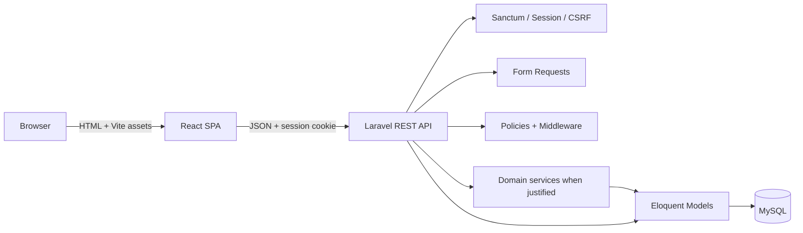

# Architecture

## System view

Laravel and React live in one repository and deploy as one web application. Laravel serves the SPA shell for non-API routes. Vite supplies development assets and creates the production bundle.

## Responsibilities

- **React:** client routing, session-aware navigation, forms, interaction state, and shadcn-based presentation. It never decides server authorization.
- **Laravel:** authentication, validation, authorization, business orchestration, JSON contracts, and SPA delivery.
- **Eloquent/MySQL:** persistent state, relationships, constraints, and transaction boundaries.
- **Sanctum:** first-party SPA session authentication with CSRF protection; no SPA bearer token is issued.

## Module boundaries

| Module | Owns | Depends on |
| --- | --- | --- |
| Auth/User | Sessions, identity, role/status, user lifecycle | Shared API envelope |
| List/Membership | List ownership, membership, list visibility | Authenticated user identity |
| Task | Tasks, multiple assignment, status, progress | List access and membership |
| Admin | User management, disabling, account deletion (planned, SRS-028) | User identity and admin middleware |
| Design system | shadcn components with preset `bhOibP160` (SRS-031) | React, Tailwind via preset |
| Landing | Public landing page at `/` (SRS-032) | Design system, auth state for dashboard link |

Cross-module values and endpoint shapes are contracts. Change them with coordinated code, documentation, and tests.

## Transaction and data-integrity boundaries

Multi-record operations run inside one database transaction so a failure at any step rolls back the whole operation (SRS-029, ADR-012): list deletion with its tasks, memberships, and assignments; task creation and assignee-set changes with multiple assignees; member removal with related assignment cleanup; and the planned account deletion. All queries use Eloquent, the Query Builder, or parameter binding — never string-interpolated raw SQL (SRS-030, ADR-013).

## Authentication flow

1. React requests `GET /sanctum/csrf-cookie`.
2. React submits email/password to `POST /api/login`; Axios sends the XSRF header.
3. Laravel validates credentials and active status, regenerates the session, and returns the public user shape.
4. Protected frontend routes restore the user with `GET /api/me`.
5. `POST /api/logout` invalidates the session and rotates the CSRF token.

## Authorization flow

Authentication and active-account middleware guard protected APIs. Admin middleware guards `/api/admin/*`. Policies decide list/task resource abilities. Query builders must still scope resources to owned/joined lists so unauthorized resources are not fetched or enumerated.

The list owner is an implicit participant and is not duplicated in `list_members`. Policies and assignment validation must count the owner as participating.

## Frontend organization

Shared shadcn primitives, layout, and UI live in `components`/`layouts`; domain-specific logic and API calls live in `features`; API configuration lives in `lib`; URL-level composition lives in `pages` and `routes`; transport/domain shapes live in `types`. The public landing page is `/`, while authenticated work begins at `/dashboard`. New abstractions require repeated use, not anticipated reuse.

Every feature (auth, admin, lists, members, tasks, assignment, progress) must be reachable through an integrated React interface (SRS-026). All UI is built on the shadcn design system configured with preset `bhOibP160` (SRS-031, ADR-014); custom CSS is allowed only for layout or visual identity not available as a shadcn component. Asynchronous operations always expose loading, empty, success, and error states.

## Route separation

Public routes render without authentication; protected routes sit behind `ProtectedRoute` and admin routes behind `AdminRoute`. The public landing page lives at `/` (SRS-032, ADR-015): it is reachable without a session, links to `/login`, and offers a dashboard link to logged-in users. `/` previously fell into the catch-all not-found route; the landing page replaces that behavior for the exact `/` path only.

## Deployment shape

The production build runs `npm run build` and publishes hashed assets under `public/build`. A PHP web server serves Laravel’s `public` directory. Production supplies MySQL, session/cache configuration, a queue worker where needed, HTTPS, and environment secrets outside Git.
