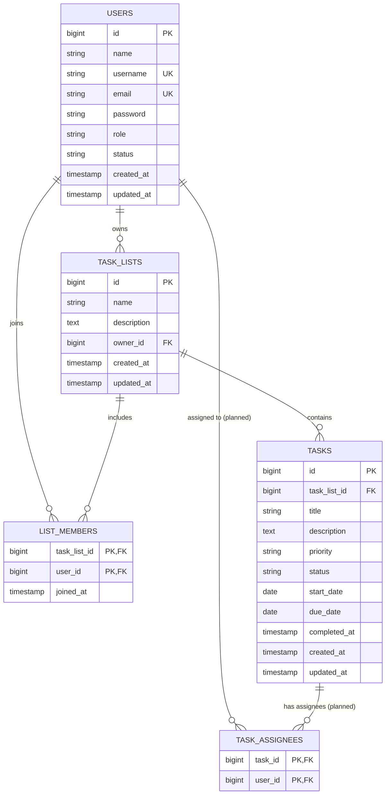

# Database Design

MySQL 8 is the runtime database. Automated tests use SQLite in memory, so migrations must remain portable unless a MySQL-specific feature is explicitly documented and tested.

The current schema still carries the legacy single `tasks.assignee_id` column. The many-to-many `task_assignees` pivot below is the **planned** replacement (SRS-027) and does not exist yet; the migration that adds the pivot and drops `assignee_id` is part of the SRS-027 work package.

## Entity relationship diagram

The legacy `USERS o|--o{ TASKS : assigned` relationship through `tasks.assignee_id` is superseded by the `TASK_ASSIGNEES` pivot once the SRS-027 migration ships.

## Tables and constraints

### `users`

`username` and `email` are unique. `role` defaults to `USER`; `status` defaults to `ACTIVE`; both are indexed. Passwords are hashed by the model cast. Laravel session, cache, job, and Sanctum token tables remain framework infrastructure.

### `task_lists`

`owner_id` references `users.id` and is indexed with creation time for owner timelines. Owner deletion is restricted to prevent orphaned collaborative history. The default account lifecycle disables users instead of deleting them.

### `list_members`

The composite primary key `(task_list_id, user_id)` is also the required uniqueness guarantee. Deleting a list or user cascades its pivot rows. `joined_at` records membership creation; the pivot intentionally has no `updated_at`.

Owners are not inserted into this table. Application logic treats `task_lists.owner_id` as implicit participation.

### `tasks`

Tasks belong to a list and cascade when the list is deleted. `priority` defaults to `MEDIUM`. **Legacy:** the schema currently still contains an optional nullable `assignee_id` (`SET NULL` on user deletion) with indexes supporting list/status, list/priority, assignee/status, and due-date queries; it accepts at most one assignee. The planned SRS-027 migration drops this column in favor of the `task_assignees` pivot below. Application validation must ensure every assignee is the owner or a current list member.

### `task_assignees` (planned — SRS-027, not yet migrated)

Many-to-many between `tasks` and `users`:

- `task_id` references `tasks.id`, `cascadeOnDelete`.
- `user_id` references `users.id`, `cascadeOnDelete`.
- Composite primary key `(task_id, user_id)` doubles as the uniqueness guarantee so the same user cannot be assigned twice to the same task.
- Optional supporting index on `(user_id, task_id)` for "tasks assigned to me" queries.
- The pivot intentionally has no timestamps, mirroring `list_members`.
- Removing a member deletes their pivot rows for tasks in the same list inside the membership-removal transaction.

## Enumerated contracts

Values are stored as bounded strings and cast to PHP backed enums:

- User role: `USER`, `ADMIN`
- User status: `ACTIVE`, `DISABLED`
- Task status: `TODO`, `IN_PROGRESS`, `COMPLETED`
- Task priority: `LOW`, `MEDIUM`, `HIGH`

String columns keep status evolution migration-friendly; Form Requests and enums enforce accepted values.

## Deletion behavior

| Deletion | Behavior |
| --- | --- |
| User owning lists | Restricted (hard delete) / decided by ADR-011 |
| User membership rows | Cascade |
| User task assignments | Legacy `assignee_id`: set null. Planned pivot: cascade delete of `task_assignees` rows |
| Task list memberships | Cascade |
| Task list tasks | Cascade (including their `task_assignees` rows) |
| Planned admin account deletion (SRS-028) | Strategy open in ADR-011; must be atomic and leave no broken relations |

Hard user deletion is not an ordinary product action today; accounts are disabled to preserve ownership and audit context. SRS-028 introduces administrator-initiated deletion whose strategy (hard delete, soft delete, or disable-only) is the open decision ADR-011.

## Atomic transactions

Every multi-record operation runs inside one database transaction and rolls back completely when any step fails (SRS-029):

| Operation | Wrapped writes |
| --- | --- |
| Delete list (owner) | Tasks, `task_assignees` rows, `list_members` rows, the list row |
| Create task with assignees | Task row + all `task_assignees` rows |
| Change assignee set | Diff of `task_assignees` insert/delete rows |
| Remove member (owner) | `list_members` row + that member's `task_assignees` rows for tasks in the same list |
| Delete user account (planned, SRS-028) | User row plus owned lists, memberships, and assignments per ADR-011 |

Automated rollback tests must prove that a forced mid-operation failure leaves the database unchanged (see [TESTING.md](TESTING.md)).
