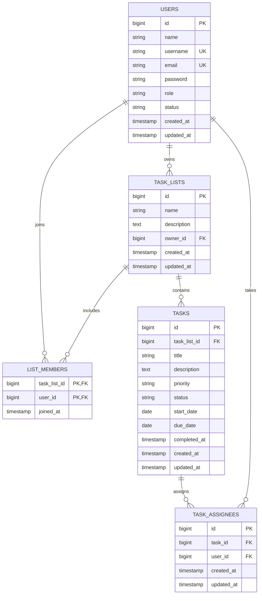

# Database Design

MySQL 8 is the runtime database. Automated tests use SQLite in memory, so migrations must remain portable unless a MySQL-specific feature is explicitly documented and tested.

The SRS-027 migration has shipped: the `task_assignees` pivot is the live schema and the legacy `tasks.assignee_id` column has been dropped (data was migrated into the pivot).

## Entity relationship diagram

The legacy `USERS o|--o{ TASKS : assigned` relationship through `tasks.assignee_id` has been superseded by the `TASK_ASSIGNEES` pivot since the SRS-027 migration shipped.

## Tables and constraints

### `users`

`username` and `email` are unique. `role` defaults to `USER`; `status` defaults to `ACTIVE`; both are indexed. Passwords are hashed by the model cast. Laravel session, cache, job, and Sanctum token tables remain framework infrastructure.

### `task_lists`

`owner_id` references `users.id` and is indexed with creation time for owner timelines. Owner deletion is restricted to prevent orphaned collaborative history. The default account lifecycle disables users instead of deleting them.

### `list_members`

The composite primary key `(task_list_id, user_id)` is also the required uniqueness guarantee. Deleting a list or user cascades its pivot rows. `joined_at` records membership creation; the pivot intentionally has no `updated_at`.

Owners are not inserted into this table. Application logic treats `task_lists.owner_id` as implicit participation.

### `tasks`

Tasks belong to a list and cascade when the list is deleted. `priority` defaults to `MEDIUM`. Tasks carry no assignee column; assignment is stored in the `task_assignees` pivot. Indexes support list/status, list/priority, and due-date queries.

### `task_assignees`

A task can be assigned to more than one participant. The composite unique `(task_id, user_id)` prevents duplicate assignment rows. Deleting a task or a user cascades its pivot rows. Application validation must ensure every assignee is the list owner or a current active member, and Form Requests reject duplicate ids in one request.

The current `assignee_id` column is the legacy single-assignee schema. SRS-027 changes the target contract to multiple assignees, but its backend migration is not implemented yet. The SRS-027 implementation must introduce a `task_assignees` pivot with a unique `(task_id, user_id)` key, migrate or intentionally reset existing assignments, update model relationships/factories/seed data, and only then remove `tasks.assignee_id`. Until that migration and the task endpoints land, the React multiple-assignee screens remain API-ready rather than end-to-end functional.

## Enumerated contracts

Values are stored as bounded strings and cast to PHP backed enums:

- User role: `USER`, `ADMIN`
- User status: `ACTIVE`, `DISABLED`
- Task status: `TODO`, `IN_PROGRESS`, `COMPLETED`
- Task priority: `LOW`, `MEDIUM`, `HIGH`

String columns keep status evolution migration-friendly; Form Requests and enums enforce accepted values.

## Deletion behavior

| Deletion | Behavior |
| --- | --- |
| User owning lists | Restricted (hard delete) / decided by ADR-011 |
| User membership rows | Cascade |
| User task assignments | Cascade (`task_assignees` rows removed) |
| Task list memberships | Cascade |
| Task list tasks | Cascade (including their `task_assignees` rows) |
| Task assignments (task deleted) | Cascade |
| Admin account deletion (SRS-028, ADR-011) | Logical: status transitions to `DISABLED`; all rows and history preserved |

Hard user deletion remains prohibited; accounts are disabled to preserve ownership and audit context. Administrator-initiated account removal (SRS-028) is implemented as logical deletion — `DELETE /api/admin/users/{user}` transitions the account to `DISABLED` while every relational record is preserved (decided in ADR-011).

## Atomic transactions

Every multi-record operation runs inside one database transaction and rolls back completely when any step fails (SRS-029):

| Operation | Wrapped writes |
| --- | --- |
| Delete list (owner) | Tasks, `task_assignees` rows, `list_members` rows, the list row |
| Create task with assignees | Task row + all `task_assignees` rows |
| Change assignee set | Diff of `task_assignees` insert/delete rows |
| Remove member (owner) | `list_members` row + that member's `task_assignees` rows for tasks in the same list |
| Logical-delete user account (SRS-028, ADR-011) | Status transition to `DISABLED`; relational history preserved |

Automated rollback tests must prove that a forced mid-operation failure leaves the database unchanged (see [TESTING.md](TESTING.md)).
