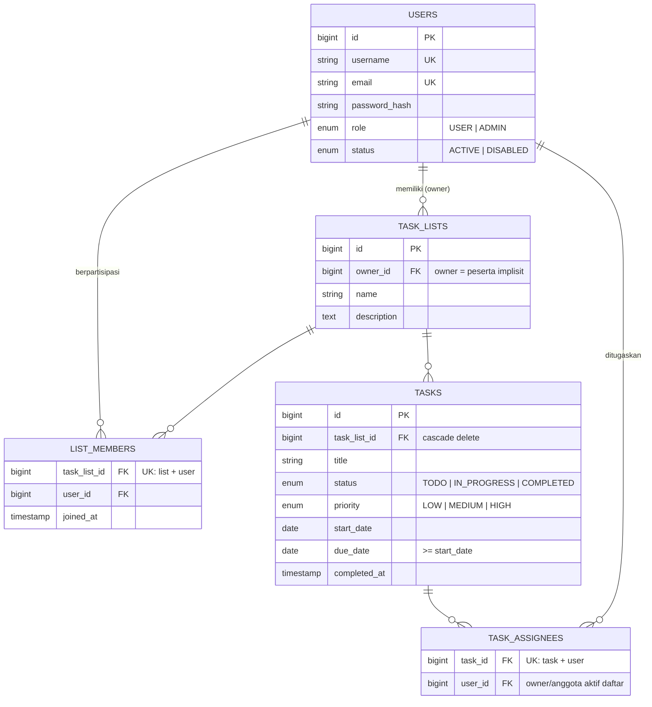

# Software Requirements Specification — JARA

JARA adalah aplikasi web untuk mengelola tugas pribadi maupun tim. Pengguna dapat membuat beberapa daftar tugas yang berfungsi sebagai list atau project, menentukan prioritas dan tenggat waktu, menandai tugas selesai, serta melihat progres. Pemilik daftar dapat menambahkan pengguna lain agar pekerjaan dapat dilakukan bersama. Sejak revisi 2026-09-16, satu tugas dapat diberikan kepada lebih dari satu peserta daftar (SRS-027). Administrator bertanggung jawab menambah, mengubah, dan menonaktifkan akun, serta dapat menghapus akun pengguna melalui logical deletion (transisi ke `DISABLED`, keputusan ADR-011) (SRS-028).

## User Story

### Pengguna

Sebagai pengguna, saya ingin mengelola daftar dan tugas dalam satu workspace agar pekerjaan pribadi maupun tim dapat direncanakan dan dipantau dengan jelas.

### Pemilik Daftar

Sebagai pemilik daftar, saya ingin mengatur anggota dan memantau progres agar kolaborasi tetap terkontrol dan seluruh pekerjaan dapat diselesaikan tepat waktu.

### Administrator

Sebagai administrator, saya ingin mengelola akun pengguna, termasuk menonaktifkan atau menghapus akun sesuai strategi retensi data yang disepakati, agar akses ke aplikasi tetap aman tanpa meninggalkan data relasi yang rusak.

## Daftar SRS

| Kode | Deskripsi | Acceptance Criteria |
| --- | --- | --- |
| **SRS-001** | Menyediakan fondasi aplikasi Laravel + React dalam satu repository. | - Laravel dapat dijalankan tanpa error.<br>- React dan TypeScript dibangun melalui Vite.<br>- Route SPA dapat dibuka langsung dari browser.<br>- Backend dan frontend menggunakan satu repository. |
| **SRS-002** | Pengguna dapat login menggunakan email dan password. | - Form menyediakan field email dan password.<br>- Email wajib berformat valid.<br>- Kredensial valid membuat session baru.<br>- Kredensial salah menghasilkan respons `422` tanpa membocorkan data sensitif.<br>- Login dibatasi dengan rate limit. |
| **SRS-003** | Aplikasi mempertahankan dan menampilkan sesi pengguna aktif. | - Frontend mengambil CSRF cookie sebelum login.<br>- Session disimpan melalui cookie HTTP-only.<br>- `GET /api/me` mengembalikan identitas, role, dan status pengguna.<br>- Refresh halaman tidak mengharuskan login ulang selama session masih berlaku.<br>- Token autentikasi tidak disimpan di local storage. |
| **SRS-004** | Pengguna dapat logout dari aplikasi. | - Logout tersedia bagi pengguna terautentikasi.<br>- Session lama dibatalkan.<br>- CSRF token diperbarui.<br>- Pengguna kembali ke halaman login dan tidak dapat membuka route terproteksi. |
| **SRS-005** | Akun berstatus `DISABLED` tidak dapat menggunakan aplikasi. | - Status akun hanya `ACTIVE` atau `DISABLED`.<br>- Akun `DISABLED` tidak dapat memulai session.<br>- Session akun yang telah dinonaktifkan ditolak pada endpoint terproteksi.<br>- Penonaktifan tidak menghapus riwayat relasi pengguna. |
| **SRS-006** | Pengguna dapat melihat daftar tugas yang boleh diakses. | - Daftar yang dimiliki pengguna ditampilkan.<br>- Daftar yang diikuti sebagai anggota ditampilkan.<br>- Daftar milik pengguna lain yang tidak diikuti tidak ditampilkan.<br>- Kondisi loading, kosong, dan error tersedia. |
| **SRS-007** | Pengguna dapat membuat daftar tugas baru. | - Nama daftar wajib diisi.<br>- Deskripsi bersifat opsional.<br>- Pembuat otomatis menjadi pemilik daftar.<br>- Pemilik tidak diduplikasi sebagai baris anggota.<br>- Daftar baru muncul pada workspace pengguna. |
| **SRS-008** | Pemilik dapat melihat dan mengubah detail daftar tugas. | - Pemilik dapat mengubah nama dan deskripsi.<br>- Anggota dapat melihat detail tetapi tidak dapat mengubah metadata.<br>- Pengguna yang tidak terkait tidak dapat melihat daftar.<br>- Validasi dan kegagalan otorisasi mengikuti format API standar. |
| **SRS-009** | Pemilik dapat menghapus daftar tugas. | - Hanya pemilik yang dapat menghapus daftar.<br>- Konfirmasi ditampilkan sebelum penghapusan.<br>- Penghapusan daftar turut menghapus membership dan tugas terkait.<br>- Anggota dan pengguna luar menerima penolakan otorisasi. |
| **SRS-010** | Pemilik dapat melihat, menambah, dan menghapus anggota daftar. | - Hanya pemilik yang dapat mengubah membership.<br>- Pengguna yang sama tidak dapat ditambahkan dua kali.<br>- Pemilik tidak dapat ditambahkan sebagai anggota biasa.<br>- `joined_at` tersimpan saat anggota ditambahkan.<br>- Anggota yang dihapus kehilangan akses ke daftar. |
| **SRS-011** | Pengguna yang berpartisipasi dapat melihat tugas dalam suatu daftar. | - Pemilik dan anggota dapat melihat tugas pada daftar tersebut.<br>- Pengguna yang tidak terkait tidak dapat melihat tugas.<br>- Tugas menampilkan judul, prioritas, status, assignee, tanggal mulai, dan tenggat bila tersedia.<br>- Kondisi daftar tugas kosong ditampilkan dengan jelas. |
| **SRS-012** | Pengguna yang berpartisipasi dapat membuat tugas. | - Judul tugas wajib diisi.<br>- Deskripsi, assignee, tanggal mulai, dan tenggat bersifat opsional.<br>- Prioritas hanya `LOW`, `MEDIUM`, atau `HIGH` dan default-nya `MEDIUM`.<br>- Status awal default adalah `TODO`.<br>- Tugas selalu terhubung dengan satu daftar.<br>- Respons berhasil mengikuti envelope API standar. |
| **SRS-013** | Pengguna yang berpartisipasi dapat mengubah dan menghapus tugas. | - Pengguna dapat mengubah field tugas yang diizinkan.<br>- Pengguna dapat menghapus tugas dari daftar yang dapat diakses.<br>- Pengguna luar menerima penolakan akses.<br>- Perubahan yang tidak valid tidak disimpan. |
| **SRS-014** | Status dan waktu penyelesaian tugas dikelola secara konsisten. | - Status hanya `TODO`, `IN_PROGRESS`, atau `COMPLETED`.<br>- Perubahan ke `COMPLETED` mengisi `completed_at`.<br>- Membuka kembali tugas mengosongkan `completed_at`.<br>- Status terbaru terlihat pada detail daftar. |
| **SRS-015** | Tugas dapat memiliki tanggal mulai dan tenggat. | - Kedua tanggal bersifat opsional.<br>- Tanggal menggunakan format yang konsisten pada API dan UI.<br>- Tenggat sebelum tanggal mulai ditolak.<br>- Tugas yang melewati tenggat dapat dibedakan pada UI. |
| **SRS-016** | Pengguna dapat menentukan prioritas tugas. | - Prioritas hanya `LOW`, `MEDIUM`, atau `HIGH`.<br>- Tugas baru memiliki prioritas default `MEDIUM`.<br>- Prioritas dapat diubah oleh peserta daftar.<br>- Prioritas terlihat pada daftar dan detail tugas.<br>- Tugas dapat difilter atau diurutkan berdasarkan prioritas. |
| **SRS-017** | Tugas dapat diberikan kepada peserta daftar. *(Superseded sebagian oleh SRS-027: bagian single-assignee tidak lagi aktif.)* | - Tugas boleh tidak memiliki assignee.<br>- Assignee hanya boleh pemilik atau anggota aktif pada daftar yang sama.<br>- Pengguna di luar daftar tidak dapat dipilih atau dikirim melalui API.<br>- Saat anggota dihapus, assignment miliknya pada daftar tersebut menjadi kosong. *(Bagian ini digantikan SRS-027: assignment anggota dihapus dari pivot `task_assignees` secara atomic.)* |
| **SRS-018** | Aplikasi menampilkan progres daftar tugas. | - Progres dihitung dari jumlah tugas `COMPLETED` dibanding total tugas.<br>- Perubahan status memperbarui progres.<br>- Daftar tanpa tugas tidak menghasilkan pembagian dengan nol.<br>- Nilai progres konsisten antara API dan UI. |
| **SRS-027** | Satu tugas dapat diberikan kepada lebih dari satu anggota. | - Assignee disimpan sebagai banyak peserta daftar pada pivot `task_assignees`.<br>- Setiap assignee wajib pemilik atau anggota aktif pada daftar yang sama.<br>- Duplikasi id assignee pada satu request ditolak.<br>- Pengiriman `assignee_ids` menggantikan seluruh penugasan sebelumnya.<br>- Saat anggota dihapus, penugasannya pada daftar tersebut dihapus. |
| **SRS-019** | Administrator dapat melihat daftar pengguna. | - Endpoint dan halaman hanya dapat diakses role `ADMIN`.<br>- Daftar menampilkan identitas, role, dan status akun.<br>- Pengguna biasa menerima respons `403`.<br>- Kondisi loading, kosong, dan error tersedia. |
| **SRS-020** | Administrator dapat membuat pengguna. | - Nama, username, email, password, role, dan status divalidasi.<br>- Username dan email harus unik.<br>- Password disimpan dalam bentuk hash.<br>- Role hanya `USER` atau `ADMIN`.<br>- Tidak tersedia registrasi publik. |
| **SRS-021** | Administrator dapat mengubah dan menonaktifkan pengguna. *(Supersedes: penghapusan akun kini ditangani SRS-028 dengan logical deletion (ADR-011); requirement ini tetap aktif untuk pengubahan data dan penonaktifan.)* | - Administrator dapat mengubah data pengguna yang diizinkan.<br>- Status dapat diubah menjadi `ACTIVE` atau `DISABLED`.<br>- Penonaktifan menghentikan akses pengguna.<br>- Pengguna tidak dihapus permanen melalui alur normal. *(Superseded oleh SRS-028: `DELETE` melakukan logical deletion ke `DISABLED`.)*<br>- Relasi historis tetap utuh. |
| **SRS-022** | Seluruh API menggunakan format respons yang konsisten. | - Respons sukses memiliki `success: true` dan data bila tersedia.<br>- Respons gagal memiliki `success: false` dan message.<br>- Error validasi memiliki kumpulan error per field.<br>- Status `401`, `403`, `404`, dan `422` digunakan secara konsisten.<br>- Stack trace dan informasi sensitif tidak dikirim ke client. |
| **SRS-023** | Aplikasi menyediakan kontrol akses sesuai peran dan relasi data. | - Endpoint terproteksi memerlukan autentikasi.<br>- Policy memeriksa kepemilikan atau membership.<br>- Middleware melindungi area administrator.<br>- Query collection tidak membocorkan record yang tidak boleh diakses.<br>- Administrator tidak otomatis dapat membaca daftar privat bila bukan peserta. |
| **SRS-024** | Antarmuka dapat digunakan pada perangkat modern dan kondisi umum. | - Layout tetap dapat digunakan pada desktop dan perangkat kecil.<br>- Form memiliki label yang dapat diakses keyboard/screen reader.<br>- Fokus, loading, empty, dan error state terlihat jelas.<br>- Preferensi reduced motion dihormati.<br>- Tidak ada error console pada alur utama. |
| **SRS-025** | Project menyediakan standar pengembangan dan pengujian tim. | - Instalasi, migrasi, seeding, dan start server terdokumentasi.<br>- Test backend dan frontend dapat dijalankan secara lokal.<br>- TypeScript, ESLint, Prettier, dan Pint tersedia.<br>- Konvensi branch, commit, PR, dan Definition of Done terdokumentasi.<br>- `.env`, dependency, dan secret tidak masuk Git. |
| **SRS-026** | Integrasi seluruh frontend React. **Pemilik: Muhammad Zaidaan Ardiyansyah.** | - Seluruh halaman aplikasi dibuat menggunakan React dan TypeScript.<br>- Frontend mencakup autentikasi, admin, daftar, anggota, tugas, assignment, dan progres.<br>- API call ditempatkan pada feature module atau shared utility, tidak tersebar di halaman.<br>- Setiap proses asynchronous memiliki loading, empty, success, dan error state.<br>- Frontend mengikuti kontrak API yang disepakati pada [API.md](API.md).<br>- Route publik dan route terproteksi dipisahkan dengan benar. |
| **SRS-027** | Multiple task assignees: satu tugas dapat diberikan kepada lebih dari satu peserta daftar. **Pemilik: Muhammad Hafidh Zufar Dewantara.** *Supersedes bagian single-assignee pada SRS-017.* | - Tugas boleh tidak memiliki assignee.<br>- Tugas dapat memiliki satu atau beberapa assignee.<br>- Assignee hanya boleh pemilik atau anggota daftar tempat tugas berada.<br>- Pengguna yang sama tidak dapat ditambahkan dua kali pada tugas yang sama.<br>- API menerima kumpulan ID `assignee_ids`, bukan `assignee_id` tunggal.<br>- Database menggunakan relasi many-to-many pada tabel pivot `task_assignees`.<br>- Ketika anggota dikeluarkan dari daftar, assignment anggota tersebut pada daftar yang sama ikut dihapus secara atomic.<br>- UI menyediakan pemilihan lebih dari satu assignee. |
| **SRS-028** | Penghapusan akun oleh administrator. **Pemilik: Muhammad Zaidaan Ardiyansyah.** *Supersedes bagian penonaktifan akun pada SRS-021: `DELETE` menggantikan penonaktifan sebagai aksi penghapusan dengan logical deletion (ADR-011, diputuskan 2026-09-16).* | - Hanya administrator aktif yang dapat melakukan penghapusan.<br>- Pengguna biasa menerima respons `403`.<br>- Administrator tidak dapat menghapus akunnya sendiri.<br>- Penghapusan adalah logical deletion: status transisi ke `DISABLED` secara idempotent, tidak meninggalkan foreign key atau data relasi yang rusak.<br>- User, list, membership, task, dan assignment historis tetap tersimpan.<br>- Respons API mengikuti envelope standar.<br>- Strategi logical deletion diputuskan dan dicatat dalam [DECISIONS.md](DECISIONS.md) (ADR-011). |
| **SRS-029** | Atomic database operations untuk semua proses multi-record. **Pemilik: Muchammad Yuda (Project Manager).** | - Penghapusan daftar beserta tugas, assignment, dan membership berjalan secara atomic.<br>- Penambahan tugas beserta beberapa assignee berjalan secara atomic.<br>- Perubahan kumpulan assignee berjalan secara atomic.<br>- Penghapusan anggota beserta assignment terkait berjalan secara atomic.<br>- Penghapusan akun beserta penanganan relasinya berjalan secara atomic.<br>- Jika satu langkah gagal, seluruh perubahan di-rollback.<br>- Tersedia automated test yang membuktikan rollback terjadi. |
| **SRS-030** | Validasi seluruh input dan perlindungan SQL injection. **Pemilik: Muchammad Yuda (Project Manager).** | - Input divalidasi menggunakan Form Request atau mekanisme Laravel yang setara.<br>- Query menggunakan Eloquent, Query Builder, parameter binding, atau prepared statement.<br>- Input pengguna tidak boleh digabungkan langsung ke raw SQL.<br>- Nilai enum, ID, tanggal, email, dan kumpulan assignee divalidasi.<br>- Input berbahaya tidak dieksekusi sebagai bagian dari query SQL.<br>- Validation error menggunakan envelope API standar dengan status `422`.<br>- Tersedia automated test untuk input tidak valid dan input yang menyerupai SQL injection. |
| **SRS-031** | Design system shadcn dengan preset `bhOibP160` untuk seluruh frontend React. **Pemilik: Muhammad Zaidaan Ardiyansyah.** | - shadcn dikonfigurasi menggunakan preset `bhOibP160`.<br>- Komponen form, button, dialog, table, navigation, feedback, dan layout menggunakan design system yang konsisten.<br>- Halaman tetap responsive pada desktop dan perangkat kecil.<br>- Komponen mempertahankan label, keyboard navigation, focus state, dan reduced-motion support.<br>- Loading, empty, error, dan success state tersedia pada komponen.<br>- CSS kustom diperbolehkan hanya untuk layout atau identitas visual yang tidak tersedia sebagai komponen shadcn. |
| **SRS-032** | Landing page publik pada route `/`. **Pemilik: Muhammad Zaidaan Ardiyansyah.** | - Landing page dapat dibuka tanpa autentikasi.<br>- Landing page menjelaskan fungsi JARA untuk tugas pribadi dan tim.<br>- Landing page menampilkan fitur list/project, prioritas, deadline, multiple assignee, dan progress.<br>- Tersedia CTA menuju `/login`.<br>- Pengguna yang sudah login dapat menuju dashboard.<br>- Landing page responsive dan accessible.<br>- Landing page mengikuti shadcn preset `bhOibP160`. |

## Batasan MVP

MVP tidak mencakup registrasi publik, lupa password, notifikasi, komentar tugas, lampiran file, recurring task, real-time update, maupun kalender eksternal. Revisi 2026-09-16 mengubah dua batasan lama:

1. Penghapusan akun pengguna oleh administrator kini berada dalam scope melalui SRS-028, diputuskan sebagai logical deletion (transisi ke `DISABLED`) dan dicatat di ADR-011. Penghapusan akun tidak menghapus baris pengguna maupun relasi historis; yang tetap wajib adalah tidak menyisakan foreign key atau data relasi yang rusak.
2. "Hapus akun" berarti logical deletion melalui status `DISABLED` (idempotent). Status `DISABLED` tetap tersedia sebagai status akun melalui `PATCH`; operasi `DELETE` mengubah status ke `DISABLED` tanpa menghapus baris.

Penambahan fitur di luar daftar SRS harus dibahas sebagai perubahan scope.

## Diagram Ringkas

### Peran dan Modul

```mermaid
flowchart LR
    U(["👤 Pengguna"])
    O(["👑 Pemilik Daftar"])
    A(["🛠️ Administrator"])

    subgraph AUTH [Autentikasi & Akun — SRS-002..005]
        F1["Login / Session / Logout\nAkun DISABLED ditolak"]
    end

    subgraph LIST [Workspace Daftar — SRS-006..010]
        F2["Lihat / buat / ubah / hapus daftar\nKelola anggota (owner saja)"]
    end

    subgraph TASK [Tugas — SRS-011..017, SRS-027]
        F3["CRUD tugas, status + completed_at,\ntanggal & prioritas\nMulti-assignee pada pivot task_assignees"]
    end

    subgraph PROG [Progres — SRS-018]
        F4["% tugas COMPLETED"]
    end

    subgraph ADMIN [Admin Users — SRS-019..021]
        F5["Lihat / buat / ubah / nonaktifkan akun"]
    end

    CROSS ["Kontrol akses &amp; envelope API — SRS-022, SRS-023"]

    U --> F1
    U --> F2
    U --> F3
    O --> F2
    O --> F3
    O --> F4
    A --> F1
    A --> F5
    F1 -.-> CROSS
    F2 -.-> CROSS
    F3 -.-> CROSS
    F4 -.-> CROSS
    F5 -.-> CROSS
```

### Model Data Inti



## Catatan Implementasi Saat Ini

Fondasi, autentikasi, skema database, policy, seed data, dan quality tooling sudah tersedia. Endpoint list, membership, task, progress, dan admin-user sudah diimplementasikan beserta UI-nya, termasuk `DELETE /api/admin/users/{user}` (logical deletion — SRS-028), input `assignee_ids` dengan respons `assignees` pada endpoint tugas (SRS-027), integrasi shadcn preset `bhOibP160` (SRS-031), dan landing page publik `/` (SRS-032).

Status endpoint aktual selalu dicatat di [API.md](API.md). Jangan menyebut endpoint planned sebagai implemented sebelum tersedia.

## Kepemilikan Requirement (Revisi 2026-09-16)

| Pemilik | Requirement |
| --- | --- |
| Muhammad Zaidaan Ardiyansyah (24060124140200) | SRS-002 sampai SRS-005, SRS-019 sampai SRS-023, serta SRS-026, SRS-028, SRS-031, SRS-032 |
| Muhammad Hafidh Zufar Dewantara (24060124140164) | SRS-011 sampai SRS-018, serta SRS-027 |
| Muchammad Yuda Tri Ananda (Project Manager) | SRS-001, SRS-029, SRS-030 |
| Nayla Husna (24060124140158) | Project Manager, reviewer, koordinator integrasi, dan pemilik dokumentasi; SRS-006 sampai SRS-010, SRS-024, SRS-025 |
